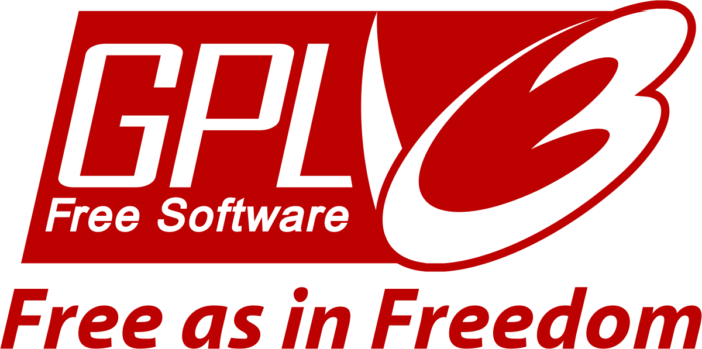

<!-- Heading -->
<h1 align="center">Ubuntu Post Install Script</h1>
    
<em>Ubuntu-based OS post install script</em> to uninstall, install and/or update packages. &#x1F913&#x1F596

---

 

<h2><strong>&#9888 Attention!</strong></h2>

While this project is fully compatible with Ubuntu-based OSes, I'm currently using <em>Zorin OS 16.3 Lite</em>. So, all the updates that I've been implementing have been made based on my needs using my system. Therefor, you may find something that you don't like, or that you don't need, or need to update. If any of these cases are yours, feel free to modify the code as per your requirements as per the <a href="https://github.com/mryujitanaka/Ubuntu-Post-Install-Script#-license">license</a> of this project.

<!-- About The Project -->
<h2><strong>&#x1F9D0 About the Project</strong></h2>
    
This project was created specifically to meet my needs after installing an Ubuntu-based OS on my computer. However, since the script I created was so good (at least for me), I decided that it was not fair to keep it just for myself. So I thought: "why not share it with the world?".

    
I bet you must have already wasted a lot of time downloading all your programs again after formatting your PC, right? You need to manually download a more updated program and so on... YUCK!

    
No more! Automate your processes and optimize your time! Let my script do all the work for you!

<!-- Built With -->
<h2><strong>&#x1F6E0 Built With</strong></h2>
    <ul>
        <li><a href="https://en.wikipedia.org/wiki/Shell_script">Shell Script</a></li>
    </ul>

<!-- Getting Started -->
<h2><strong>&#x1F3C1 Getting Started</strong></h2>
    
This project contains 3 .sh files: <a href="https://github.com/vyujitanaka/Ubuntu-Post-Install-Script/blob/master/1.Setup.sh">1.Setup.sh</a>, <a href="https://github.com/vyujitanaka/Ubuntu-Post-Install-Script/blob/master/2.Apps-to-Install.sh">2.Apps-to-Install.sh</a> and <a href="https://github.com/vyujitanaka/Ubuntu-Post-Install-Script/blob/master/3.SystemUpdateUpgrade.sh">3.SystemUpdateUpgrade.sh</a>.

    
This means that you must first run the <em>1.Setup.sh</em> script, then the <em>2.Apps-to-Install.sh</em> script and finally the <em>3.SystemUpdateUpgrade.sh</em> script.

    
<strong>ATTENTION!</strong> Before you run the scripts on your system, especially the first one (1.Setup.sh), make sure your terminal has <em>Unlimited Scroolback</em> enabled. With this function enabled, you will be able to fully view the entire script output history by scrolling your terminal sidebar up.

<!-- Prerequisites -->
<h3>Prerequisites</h3>
    <ul>
        <li>Have a computer with Ubuntu-based distribution installed;</li>
        <li>Have basic knowledge of Linux;</li>
        <li>Basic familiarity with the Linux terminal;</li>
        <li>Internet access.</li>
    </ul>

<!-- Usage Examples -->

### Usage

&#128073; First, [download](https://github.com/vyujitanaka/Ubuntu-Post-Install-Script/archive/refs/heads/master.zip) the files.

&#128073; Then extract the .sh files.

&#128073; After extracting the .sh files, first run the 1.Setup.sh script on your terminal.

&#9888; If you don't know how to run a .sh file on the terminal, click [here](https://askubuntu.com/questions/38661/how-do-i-run-sh-scripts).

&#128073; When the **1.Setup.sh** script is finished, restart your computer.

&#128073; After restarting your computer, run the **2.Apps-to-Install.sh** script.

&#128073; When the 2nd script is finished, restart your PC again.

&#9888; You may be wondering: "what about the third script?". Well, it can be used whenever you want to update your packages, without installing new programs on your system. The **3.SystemUpdateUpgrade.sh** script works more or less like a Windows Update, but **YOU** are in control!

&#127881; That's it! Now enjoy the programs that were automatically downloaded to your computer!

### Notes

I recommend you run the scripts after you have freshly installed your ubuntu-based operating system.

The scripts were created specifically to meet my needs. So, if you want to change them to suit yours and/or share them with others, you can according to the [license](https://github.com/mryujitanaka/Ubuntu-Post-Install-Script#-license) of this project.

Before running the scripts, I strongly recommend that you study them and observe what they will update/install on your computer.

I am not responsible for possible errors that may occur on your computer. Keep in mind that you are fully responsible for your actions from the moment you download any files or clone this repository.

The tests performed successfully were done on Ubuntu-based operating systems, like *Pop_OS! 20.X LTS*, _Linux Mint XFCE 20.X LTS_ and _Zorin OS 16.3 Lite_.

<!-- Contributing -->
<h2><strong>&#128200;&#129309; Contributing</strong></h2>

Improvements are always welcome, but they are only possible if you contribute in some way. Do not be shy!

click .

If you find a bug in the source code, you can help me by submitting a <a href="https://github.com/mryujitanaka/Ubuntu-Post-Install-Script/issues">Bug Report</a>. Even better, you can submit a <a href="https://github.com/mryujitanaka/Ubuntu-Post-Install-Script/pulls">Pull Request</a> with a fix.

<!-- To Do -->
<h2><strong>&#128221; To Do</strong></h2>

Add the programs below to the script to be downloaded:

&#9723; Dropbox

&#9723; Local by Flywheel

&#9723; OCS-URL

&#9723; Sweet-Ambar-Blue Theme

&#9723; Sweet-Dark Theme

<!-- License -->
<h2><strong>&#9878; License</strong></h2>

Above the license, my script is based (and inspired by the <a href="https://mediatemple.net/blog/web-development-tech/wordpress-philosophy-four-freedoms/">WordPress Philosophy</a>) in four freedoms:

<ul> 
    <li>The 1st: To run the program for any purpose.</li>
    <li>The 2nd: To study how the program works and change it to make it do what you wish.</li>
    <li>The 3rd: To redistribute.</li>
    <li>The 4th: To distribute copies of your modified versions to others.</li>
</ul>
 

Distributed under the GPLv3 License. For more information, click <a href="https://github.com/vyujitanaka/Ubuntu-Post-Install-Script/blob/master/LICENSE">here</a>.

<!-- License Logos -->

    <tr>
        <td>
            
        </td>
    </tr>
    <tr>
        <td>
            
        </td>
    </tr>

<!-- Contact -->
<h2><strong>&#128421; Contact</strong></h2>

&#128226; <a href="https://mryujitanaka.com/">mryujitanaka.com</a>

<!-- Acknowledgements-->
<h2><strong>&#129392; Acknowledgements</strong></h2>
    <ul>
        <li><a href="https://github.com/Diolinux/gabrielworkstation">gabrielworkstation</a></li>
        <li><a href="https://github.com/ChrisTitusTech/Ubuntu18-setup">Ubuntu18-setup</a></li>
        <li><a href="https://plus.diolinux.com.br/t/erro-ao-baixar-programas-via-shell-script-pelo-terminal-no-ubuntu/27328">Erro ao baixar programas via Shell Script pelo terminal no Ubuntu</a></li>
        <li><a href="https://github.com/ikatyang/emoji-cheat-sheet">emoji-cheat-sheet</a></li>
        <li><a href="https://github.com/othneildrew/Best-README-Template">Best-README-Template</a></li>
    </ul>